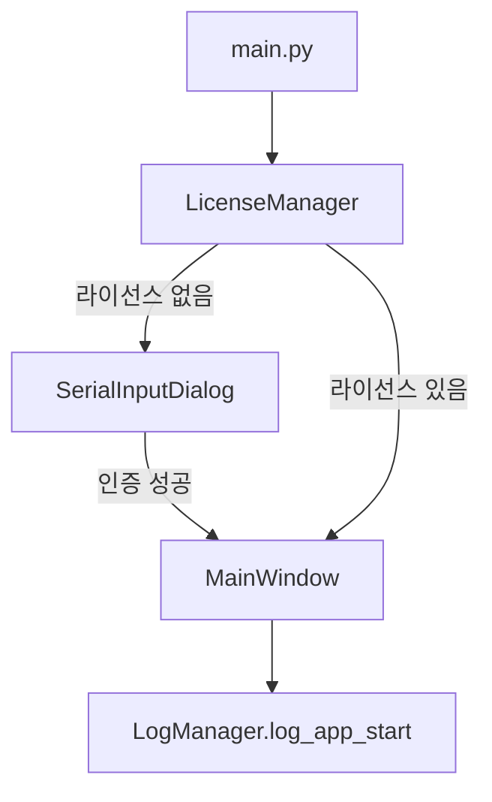
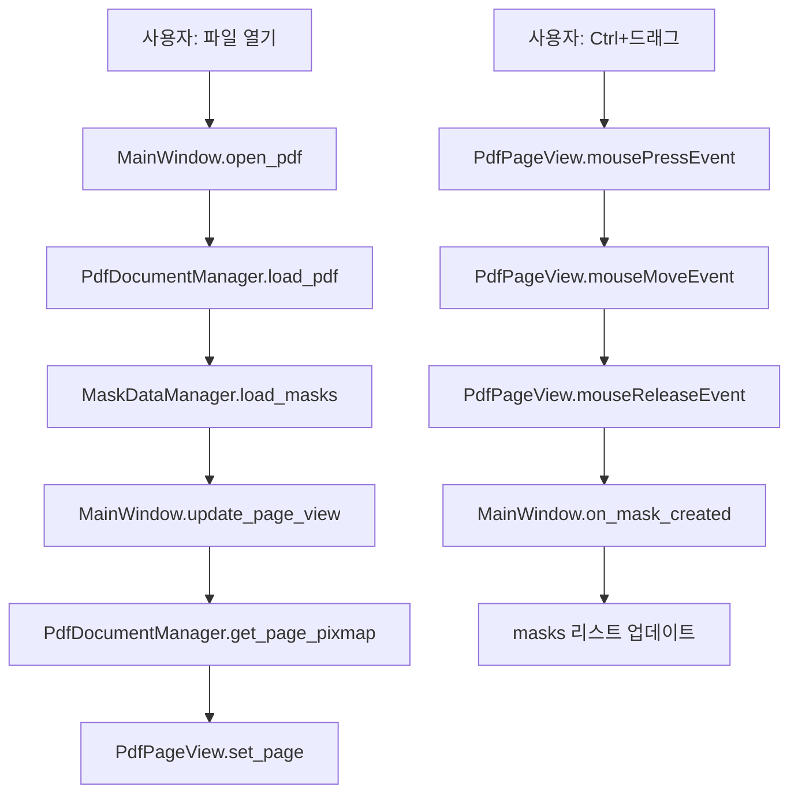
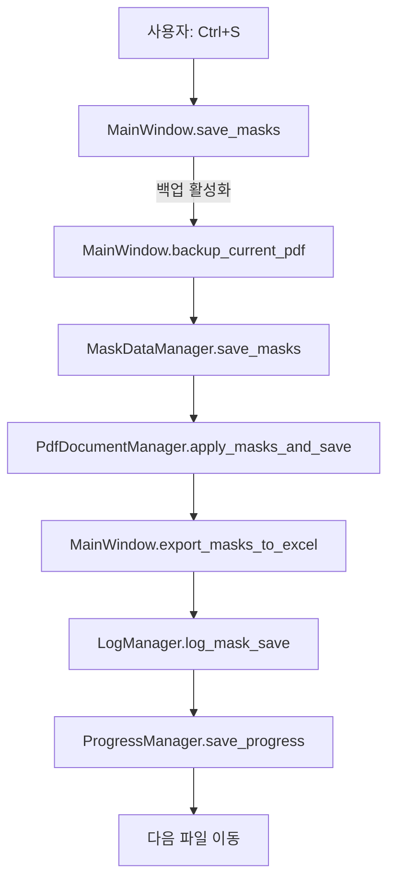

# PDF Mask 아키텍처 개요

버전: 1.5.0  
작성일: 2025-11-19

## 1. 개요

PDF Mask는 **계층화된 모듈 구조**를 따르며, 각 모듈은 명확한 책임을 갖습니다.

```
┌──────────────────────────────────────┐
│          UI Layer (ui/)              │  ← 사용자 인터페이스
│  MainWindow, PdfView, Dialogs        │
└──────────────────────────────────────┘
                 ↓
┌──────────────────────────────────────┐
│      Business Logic (managers/)      │  ← 비즈니스 로직
│  License, PDF, MaskData, Progress    │
│  Log Managers                        │
└──────────────────────────────────────┘
                 ↓
┌──────────────────────────────────────┐
│       Data Models (core/)            │  ← 데이터 구조
│  MaskEntry                           │
└──────────────────────────────────────┘
                 ↓
┌──────────────────────────────────────┐
│    External Libraries                │  ← 외부 라이브러리
│  PyQt6, PyMuPDF, openpyxl            │
└──────────────────────────────────────┘
```

---

## 2. 디렉터리 구조

```
src/
├── main.py                     # 진입점: 라이선스 검증 및 메인 윈도우 실행
└── pdfmask/
    ├── __init__.py
    ├── core/                   # 핵심 데이터 모델
    │   ├── __init__.py
    │   └── models.py           # MaskEntry (마스킹 정보)
    │
    ├── managers/               # 비즈니스 로직 관리자
    │   ├── __init__.py
    │   ├── license_manager.py  # 라이선스 인증
    │   ├── pdf_manager.py      # PDF 로드, 렌더링, Redaction
    │   ├── mask_data_manager.py # 마스킹 데이터 JSON 저장/로드
    │   ├── progress_manager.py # 작업 진행상황 관리
    │   └── log_manager.py      # 로그 기록
    │
    ├── ui/                     # 사용자 인터페이스
    │   ├── __init__.py
    │   ├── main_window.py      # 메인 윈도우 (QMainWindow)
    │   ├── pdf_view.py         # PDF 뷰어 및 마스킹 선택 (QWidget)
    │   └── dialogs.py          # 라이선스 다이얼로그 (QDialog)
    │
    └── utils/                  # 유틸리티 (향후 확장)
        └── __init__.py
```

---

## 3. 모듈별 책임

### Core (핵심 데이터)
- **책임**: 애플리케이션 전반에서 사용되는 데이터 구조 정의
- **주요 클래스**: `MaskEntry`
- **의존성**: `fitz` (PyMuPDF)

### Managers (비즈니스 로직)
- **책임**: 각 도메인별 로직 처리
- **주요 클래스**:
  - `LicenseManager`: 시리얼 번호 검증, 라이선스 파일 관리
  - `PdfDocumentManager`: PDF 파일 I/O, 페이지 렌더링, Redaction 적용
  - `MaskDataManager`: 마스킹 데이터 영속화 (JSON)
  - `ProgressManager`: 폴더 작업 진행상황 추적
  - `LogManager`: 애플리케이션 로그 기록
- **의존성**: `core.models`, `fitz`, `json`, `logging`

### UI (사용자 인터페이스)
- **책임**: GUI 컴포넌트 및 사용자 상호작용
- **주요 클래스**:
  - `MainWindow`: 전체 애플리케이션 창, 메뉴, 툴바, 이벤트 처리
  - `PdfPageView`: PDF 페이지 렌더링 및 마스킹 드래그 선택
  - `ScrollablePdfView`: 스크롤 및 줌 기능
  - `SerialInputDialog`: 라이선스 입력 다이얼로그
- **의존성**: `managers`, `core.models`, `PyQt6`

### Utils (유틸리티)
- **책임**: 공통 유틸리티 함수 (현재 비어있음, 향후 확장)

---

## 4. 데이터 흐름

### 4.1 애플리케이션 시작



### 4.2 PDF 파일 열기 및 마스킹



### 4.3 마스킹 저장



---

## 5. 설계 원칙

### 5.1 단일 책임 원칙 (SRP)
- 각 클래스는 하나의 책임만 갖습니다.
- 예: `PdfDocumentManager`는 PDF 처리만, `LogManager`는 로그만 담당

### 5.2 의존성 역전 원칙 (DIP)
- UI는 Managers에 의존하지만, Managers는 UI를 알지 못합니다.
- Managers는 Core 모델에 의존합니다.

### 5.3 개방-폐쇄 원칙 (OCP)
- 새로운 관리자를 추가할 때 기존 코드를 수정하지 않고 확장 가능합니다.
- 예: `TemplateManager`를 추가해도 기존 코드 변경 없음

### 5.4 인터페이스 분리 원칙 (ISP)
- 각 Manager는 명확한 public 메서드만 제공합니다.
- 예: `MaskDataManager`는 `save`, `load`, `delete` 메서드만 노출

---

## 6. 확장 가이드

### 6.1 새로운 관리자 추가

**예: 템플릿 관리 기능 추가**

1. `src/pdfmask/managers/template_manager.py` 생성
   ```python
   class TemplateManager:
       def __init__(self):
           self.templates_dir = "templates/"
       
       def save_template(self, name: str, masks: List[MaskEntry]) -> bool:
           # 템플릿 저장 로직
           pass
       
       def load_template(self, name: str) -> List[MaskEntry]:
           # 템플릿 로드 로직
           pass
   ```

2. `src/pdfmask/managers/__init__.py`에 추가
   ```python
   from .template_manager import TemplateManager
   
   __all__ = [..., 'TemplateManager']
   ```

3. `MainWindow`에서 사용
   ```python
   from ..managers import TemplateManager
   
   self.template_manager = TemplateManager()
   ```

### 6.2 새로운 UI 컴포넌트 추가

**예: 템플릿 선택 다이얼로그**

1. `src/pdfmask/ui/template_dialog.py` 생성
   ```python
   class TemplateDialog(QDialog):
       def __init__(self, parent=None):
           super().__init__(parent)
           self.setup_ui()
   ```

2. `src/pdfmask/ui/__init__.py`에 추가
   ```python
   from .template_dialog import TemplateDialog
   
   __all__ = [..., 'TemplateDialog']
   ```

3. `MainWindow`에서 호출
   ```python
   dialog = TemplateDialog(self)
   if dialog.exec() == QDialog.DialogCode.Accepted:
       # 선택된 템플릿 로드
       pass
   ```

### 6.3 새로운 데이터 모델 추가

**예: 템플릿 데이터 클래스**

1. `src/pdfmask/core/models.py`에 추가
   ```python
   @dataclass
   class Template:
       name: str
       description: str
       masks: List[MaskEntry]
       created_at: datetime
   ```

2. `src/pdfmask/core/__init__.py`에 추가
   ```python
   from .models import MaskEntry, Template
   
   __all__ = ['MaskEntry', 'Template']
   ```

---

## 7. 테스트 전략

### 7.1 단위 테스트

**Managers 테스트**:
```python
# tests/test_managers/test_license_manager.py
def test_validate_serial():
    manager = LicenseManager()
    valid, msg = manager.validate_serial("TEST-1234-5678-ABCD")
    assert valid == True
```

**Data Models 테스트**:
```python
# tests/test_core/test_models.py
def test_mask_entry_creation():
    rect = fitz.Rect(0, 0, 100, 100)
    mask = MaskEntry(page_index=0, rect=rect, note="test")
    assert mask.page_index == 0
```

### 7.2 통합 테스트

**PDF 저장 흐름 테스트**:
```python
# tests/test_integration/test_save_flow.py
def test_save_masks_with_backup():
    # 1. PDF 로드
    # 2. 마스킹 추가
    # 3. 백업 수행
    # 4. 저장 확인
    pass
```

---

## 8. 성능 고려사항

### 8.1 메모리 관리

- **대용량 PDF**: 페이지 단위 렌더링으로 메모리 절약
- **Pixmap 캐싱**: 현재 페이지만 메모리에 유지

### 8.2 파일 I/O 최적화

- **일자별 파일 분리**: 로그 및 마스킹 데이터를 날짜별로 분리하여 조회 속도 향상
- **incremental 저장**: PyMuPDF의 incremental 모드로 저장 속도 개선

### 8.3 UI 반응성

- **비동기 렌더링**: 대용량 PDF 렌더링 시 UI 블로킹 방지 (향후 개선)
- **실시간 미리보기**: 드래그 중 즉시 사각형 표시

---

## 9. 보안 고려사항

### 9.1 라이선스 관리

- **해시 저장**: 시리얼 번호를 SHA256 해시로 저장
- **서버 인증**: 실제 배포 시 서버 API 연동 필요

### 9.2 데이터 보호

- **백업 암호화**: 백업 파일 암호화 (향후 개선)
- **로그 마스킹**: 민감 정보를 로그에 기록하지 않음

### 9.3 파일 접근

- **권한 체크**: 파일 저장 전 권한 확인
- **경로 검증**: 사용자 입력 경로 검증

---

## 10. 배포 가이드

### 10.1 개발 환경

```bash
# 의존성 설치
uv sync

# 실행
uv run python src/main.py
```

### 10.2 패키징 (PyInstaller)

```bash
# 단일 실행 파일 생성
pyinstaller --onefile --windowed \
  --name PDFMask \
  --icon=icon.ico \
  src/main.py
```

### 10.3 배포 체크리스트

- [ ] 라이선스 서버 API 구현
- [ ] 테스트 시리얼 제거
- [ ] 에러 핸들링 강화
- [ ] 사용자 문서 업데이트
- [ ] 버전 번호 업데이트

---

## 11. 유지보수 가이드

### 11.1 일반적인 수정 작업

**메뉴 항목 추가**:
- `MainWindow.setup_menu()` 메서드 수정
- 새로운 액션 메서드 추가

**단축키 추가**:
- `MainWindow.setup_shortcuts()` 메서드 수정

**로그 포맷 변경**:
- `LogManager.setup_logger()` 메서드 수정

### 11.2 디버깅 팁

**로그 확인**:
- `logs/pdfmask_YYYYMMDD.log` 파일 확인
- 로그 레벨: INFO, WARNING, ERROR

**진행상황 확인**:
- `progress.json` 파일 확인
- 폴더 작업 시 중단 지점 파악

**마스킹 데이터 확인**:
- `masks_data/mask_data_YYYYMMDD.json` 파일 확인
- JSON 포맷으로 수동 편집 가능

---

## 12. 라이선스 및 기여

- **라이선스**: MIT (자유롭게 사용 가능)
- **기여 방법**: GitHub Pull Request
- **이슈 보고**: GitHub Issues

---

**PDF Mask v1.5** - 유지보수 가능한 아키텍처

